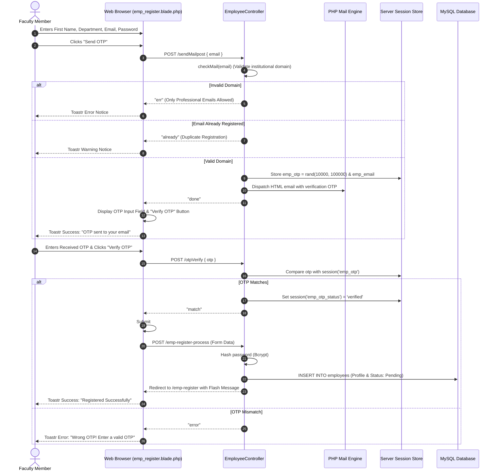
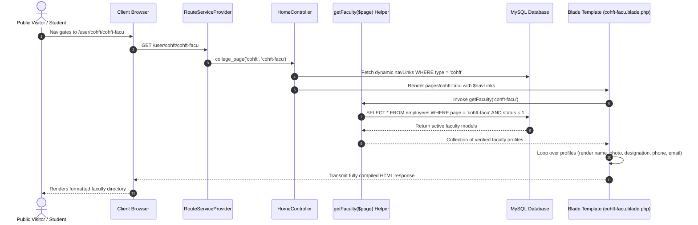
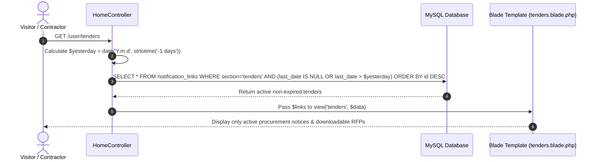

# 🏛️ Dr. YSP University — System Architecture

This document details the architectural design, execution workflows, component interactions, and data boundaries of the Dr. Yashwant Singh Parmar University of Horticulture & Forestry web portal and academic ERP platform ([https://uhf.ac.in/](https://uhf.ac.in/)).

---

## 1. Architectural Philosophy

The YSP University platform is engineered as a **High-Cohesion Classical MVC Monolith** built on **Laravel 8 and MySQL**. 

In higher education and state agricultural university environments, administrators, faculty members, students, and rural farmers need high-availability access to institutional circulars, verified faculty rosters, procurement tenders, and academic course catalogs. By adopting a cohesive MVC architecture:
- **Zero Frontend Hydration Lag:** Academic and administrative pages are rendered server-side via Laravel Blade, ensuring near-instant loading across varied network bandwidths in hilly regional campuses.
- **Transactional Integrity:** Administrative updates to faculty statuses, navigation menus, and course tables execute within ACID-compliant relational transactions.
- **Fail-Closed Dual Security:** Separate middleware guards (`AdminAuth` and `EmpAuth`) enforce strict role isolation between central university administrators and registered faculty members.

```mermaid
flowchart TD
    subgraph ClientTier["Client & User Interfaces"]
        A1["🌐 Public Visitors (Students, Farmers, General Public)"]
        A2["👨‍🏫 Faculty Members (Self-Service Profile Portal)"]
        A3["🏢 Super Administrators (Governance ERP Console)"]
    end

    subgraph IngressTier["Ingress & Web Server Tier"]
        B1["Apache / Nginx Web Server"]
        B2[".htaccess URL Rewriter & Static Asset Engine"]
        B3["Laravel RouteServiceProvider (routes/web.php)"]
    end

    subgraph SecurityTier["Security & Authentication Tier"]
        C1["🛡️ AdminAuth Middleware (Session Guard)"]
        C2["🛡️ EmpAuth Middleware (Session Guard)"]
        C3["🔑 Email OTP Handshake & Professional Domain Validator"]
        C4["🔒 Bcrypt Password Cryptography (Hash::make / check)"]
    end

    subgraph AppTier["Application Core (Laravel 8 MVC)"]
        D1["HomeController (Public Pages, Tenders, Dynamic Views)"]
        D2["AdminController (Faculty, Notices, Navbars, Status Toggles)"]
        D3["EmployeeController (OTP Auth, Profile CRUD, Doc Uploads)"]
        D4["AdminTablesController (Course Matrix CRUD & Management)"]
        D5["ContactController & ServiceController (Inquiries & Dynamic CMS)"]
        D6["Global Helpers Engine (getFaculty Page-Binding Helper)"]
    end

    subgraph DataTier["Persistence & Asset Storage Tier"]
        E1[("MySQL Relational Database")]
        E2["Local Storage Driver (public/uploads/{profile_images, emp_doc, docs})"]
    end

    ClientTier --> IngressTier
    IngressTier --> SecurityTier
    SecurityTier --> AppTier
    AppTier --> DataTier
```

---

## 2. Layered Component Architecture

### 2.1 Ingress & Routing Tier
- **Web Server:** Terminates HTTP/HTTPS traffic, handles gzip compression for static assets (`css`, `js`, `images`), and forwards dynamic requests via `.htaccess` rewrites to `public/index.php`.
- **Route Service Provider (`routes/web.php`):**
  - **Public Routing Group:** Handles root institutional portal (`/`), dynamic page resolvers (`/{name}`), multi-college department pages (`/user/{type}/{page}`), tenders (`/user/tenders`), job listings (`/user/jobs`), and NIRF disclosures (`/user/nirf`).
  - **Admin Operational Group (`admin_auth`):** Enforces super-admin authentication across `/admin/dashboard`, notification management (`/admin/notification/{url}`), faculty management (`/admin/faculty`), navigation menu CRUD (`/admin/navbar`), and course matrix editor (`/admin/table/coh-course-table`).
  - **Faculty Self-Service Group (`emp_auth`):** Enforces employee authentication for profile maintenance (`/employee/profile`), credential updates, and faculty circulars (`/employee/notification`).

### 2.2 Application Services Tier
- **Faculty Onboarding & Verification Service (`EmployeeController`):**
  - Enforces professional/institutional email verification (`checkMail()`).
  - Asynchronously generates numeric OTPs, caches them into server sessions (`emp_otp`, `emp_email`), and verifies them via AJAX pre-flight endpoints.
  - Handles profile pictures and credential documentation uploads (`storeAs('public/uploads/...')`).
- **Dynamic Page-Binding & Directory Resolver (`app/helpers.php` & `AdminController`):**
  - Admins assign registered faculty members to specific page slugs (e.g., `cohft-facu`).
  - Global helper function `getFaculty($page)` executes direct, parameterized queries against `employees` table to embed live faculty rosters into target college views.
- **Notice, Tender & Circular Dispatcher (`HomeController` & `AdminController`):**
  - Manages categorized publication of circulars across sections (`notification`, `farmer`, `links`, `tenders`, `vacancy`, `employment`, `nirf`).
  - Queries dynamically filter out past deadlines using `last_date > yesterday` logic.
- **Dynamic Academic Table & Curriculum Manager (`AdminTablesController`):**
  - Manages tabular course listings (`Table` model / `tables` table) with fields for serial numbers, course codes, course titles, and credit hours.

### 2.3 Persistence Tier (MySQL)
The database architecture comprises relational tables designed for institutional data management:
- `admins`: Super administrator credentials and audit timestamps.
- `employees`: Registered faculty roster, professional email, hashed passwords, department, college, discipline, specialization, mission, profile photo, document attachment, assigned page, and approval status (`status: 1/0`).
- `notification_links`: Classified circulars, tenders, job posts, attachments, links, and validity expiration dates (`last_date`).
- `navbar`: Dynamic menu registry with hierarchical page URLs and campus category types (`type`: `cohft`, `basic-science`, etc.).
- `fac_pages`: Page slug index for faculty directory mapping.
- `tables`: Dynamic academic course catalogs and credit-hour records.
- `contacts`: Inbound public inquiry submissions and messages.

---

## 3. Core Execution Workflows

### 3.1 Faculty Self-Registration & Asynchronous OTP Handshake

### 3.2 Dynamic Faculty Directory Rendering Flow

### 3.3 Dynamic Auto-Expiry Notice Dispatch Flow

---

## 4. Key Architectural Decisions (ADRs)

| Area | Decision | Rationale |
|---|---|---|
| **Architecture Pattern** | Monolithic Laravel 8 MVC | Provides tight coupling between UI forms, session state, and file storage, eliminating network latencies and microservice synchronization complexities. |
| **Faculty Page Binding** | Helper-Driven Dynamic Lookup (`getFaculty`) | Allows super-admins to change a faculty member's departmental assignment in one click without modifying static Blade templates. |
| **Email Verification** | Session-Cached Two-Phase OTP Challenge | Prevents unverified or bot registrations without requiring external authentication providers (e.g., OAuth/SSO). |
| **Notice Lifecycle** | Query-Level Automated Date Filtering | Automatically eliminates expired notices and tenders from public listings based on `last_date` without requiring cron workers. |
| **Status Management** | Asynchronous AJAX Status Toggling | Enables super-admins to activate or deactivate faculty profiles instantly with immediate visual feedback via Toastr. |

---

## 5. Security & Operational Reliability

- **Dual-Tier Session Isolation:** Central super-admin privileges (`ADMIN_LOGIN`) and faculty portal privileges (`EMP_LOGIN`) are completely isolated in separate session keys.
- **Fail-Closed Access Control:** Middleware layers (`AdminAuth` and `EmpAuth`) immediately abort unauthorized requests and redirect with flash notifications.
- **Bcrypt Password Cryptography:** All user and administrative credentials utilize `Illuminate\Support\Facades\Hash` with secure salt generations.
- **CSRF Protection:** Every state-changing HTTP request and AJAX call (`$.ajaxSetup`) passes active `X-CSRF-TOKEN` headers.
- **SQL Injection Prevention:** All queries utilize Eloquent ORM or parameterized query builder methods (`where(['page' => $page])`), preventing SQL injection attacks.
