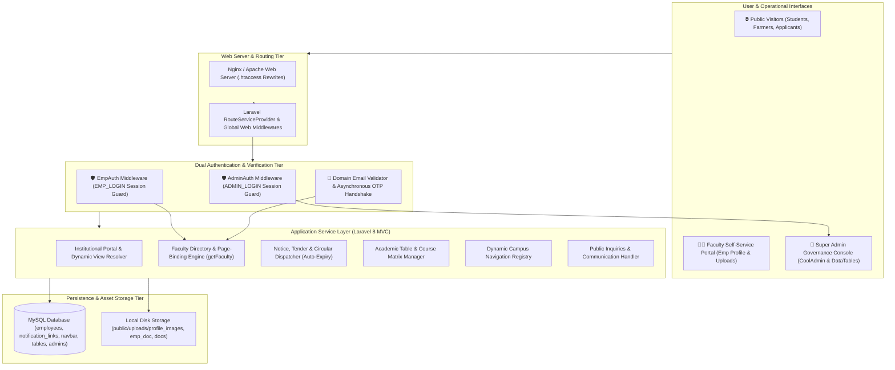
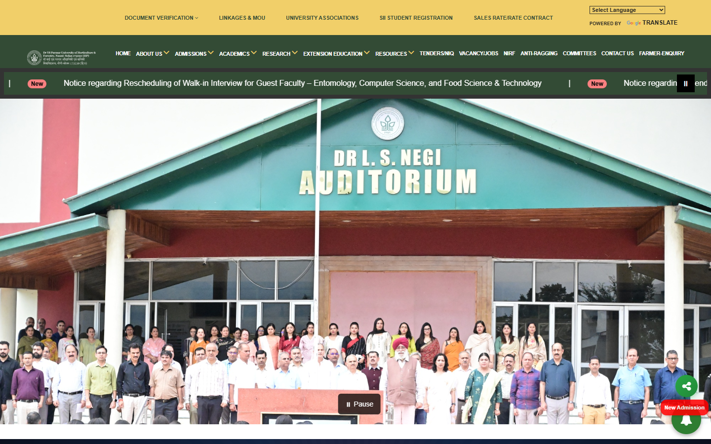

# 🏛️ Dr. YSP University — Institutional Web Portal & Academic Faculty ERP

> **A comprehensive institutional web platform, faculty onboarding portal, and centralized notice & tender management system engineered for Dr. Yashwant Singh Parmar University of Horticulture & Forestry (UHF Nauni, Solan).**

[](https://www.php.net/)
[](https://laravel.com/)
[](https://www.mysql.com/)
[](https://getbootstrap.com/)
[](https://jquery.com/)
[](https://datatables.net/)
[](https://codeseven.github.io/toastr.js/)
[](https://uhf.ac.in/)
[](#private-repository-notice)

---

## 📌 Notice
*This is a public technical showcase repository documenting the architecture, domain design, and technical decisions of the Dr. YSP University Platform (Live Institutional Portal: [https://uhf.ac.in/](https://uhf.ac.in/)). The production institutional database records, credentials, and internal operational data remain proprietary and private.*

---

## 💡 The Problem

State agricultural and forestry universities with sprawling multi-campus footprints (spanning horticulture colleges, forestry institutes, regional research stations, and Krishi Vigyan Kendras / KVKs across high-altitude and valley zones) face significant institutional communication and governance bottlenecks:

- **Decentralized Faculty Directory Management:** Faculty profiles, research specializations, and departmental memberships are scattered across paper registers or static departmental webpages, making dynamic directory updates and faculty verification tedious.
- **Unverified Profile Updates:** Without institutional domain verification or OTP handshakes, public staff registries risk unauthorized profile modifications or duplicate registrations.
- **Manual Notice Expiry & Circular Clutter:** Academic circulars, procurement tenders, employment notices, and agro-advisories linger on university websites long after submission deadlines, confusing students, farmers, and applicants.
- **Multi-College & Multi-Station Information Silos:** Connecting 4+ constituent colleges, 5+ Regional Horticultural Research & Training Stations (RHR&TS), and 5+ KVKs across Himachal Pradesh under a single dynamic navigation hierarchy requires complex CMS management.
- **Static Course Catalogs & Curriculum Tables:** Academic departments struggle to update semester course matrices, credit-hour distributions, and course syllabus tables without hardcoded code deployments.

---

## 🚀 The Solution: YSP University Platform

The YSP University Platform provides a full-stack, unified academic governance, faculty management, and institutional information portal:

1. **Faculty Self-Service & Onboarding ERP:**
   - Asynchronous institutional domain validation (`@tingebharat.com` / university email pattern filter).
   - Live AJAX-driven email OTP dispatch and real-time session verification before account creation.
   - Comprehensive profile management (credentials, research mission, discipline, specialization, contact data, profile avatar, and curriculum vitae document uploads).
2. **Dynamic Faculty-to-Department Page Binding:**
   - Administrative page-binding engine associating approved faculty members with designated college/department URLs (e.g., `cohft-facu`, `bsc-facu`).
   - Global helper function `getFaculty($page)` enabling dynamic, zero-maintenance faculty directory rendering across college websites.
3. **Automated Circular, Tender & Job Expiration Engine:**
   - Real-time date-filtered queries (`where('last_date', '>', $yesterday)`) automatically archiving expired tenders, job vacancies, and student notifications from public listings.
   - Segmented publication feeds for Tenders, Vacancies, NIRF Ranking Disclosures, Farmer's Corner, and Department Circulars.
4. **Dynamic Academic Tables & Course Matrix Manager:**
   - Dynamic tabular CRUD engine allowing administrators to publish and edit course codes, course titles, and credit hours without touching template code.
5. **Multi-Campus Hierarchy & Navigation Engine:**
   - Database-backed navigation registry (`navbar`) partitioning links by campus context (College of Horticulture, College of Forestry, Neri Campus, Thunag Campus, RHR&TS stations, KVK centers).
6. **Dual-Tier Session Authentication Guards:**
   - Distinct, fail-closed middleware layers: `AdminAuth` for centralized super-admin governance and `EmpAuth` for faculty self-service.

---

## 🏗️ System Architecture at a Glance



---

## 🧩 Core Platform Subsystems

| Subsystem | Primary Tech Stack | Description |
|---|---|---|
| **Faculty Onboarding & OTP Engine** | Laravel 8, PHP Mailer, jQuery AJAX, Toastr | Validates professional institutional emails, issues session OTPs, and registers faculty profiles. |
| **Faculty Directory & Page Binder** | Blade, MySQL, Helper Functions (`getFaculty`) | Dynamically renders active faculty profiles into college and departmental sub-pages. |
| **Notice & Tender Dispatcher** | Eloquent ORM, Query Builder, Storage API | Publishes classified circulars, tenders, and job notices with automated last-date expiration filters. |
| **Dynamic Academic Table Manager** | Laravel 8 MVC, Blade, DataTables | Admin-controlled CRUD for course syllabi, credit-hour matrices, and departmental curriculum tables. |
| **Campus Navigation Engine** | MySQL `navbar` Schema, Blade Macro Views | Database-backed multi-level navigation tree for colleges, research stations, and KVK centers. |
| **Public Institutional Portal** | Blade, Bootstrap 4, Owl Carousel, Magnific Popup | Responsive university web experience covering admissions, research mandates, and student services. |
| **Admin Governance Console** | CoolAdmin Theme, DataTables 1.13, Toastr.js | Centralized portal for faculty approvals, AJAX status toggling, notification publishing, and messaging. |

---

## 🛡️ Key Engineering Highlights

### 1. Asynchronous Institutional Domain Email & OTP Verification
To ensure only legitimate university personnel register faculty profiles, the system performs a multi-stage challenge before account creation:
1. **Institutional Domain Enforcement:** The email domain is verified against authorized suffixes (`@tingebharat.com` / university domain).
2. **AJAX Pre-Flight Duplicate Check:** Checks existing database records to prevent duplicate email registrations.
3. **Session-Bound OTP Challenge:** Generates a cryptographically randomized numeric OTP, transmits it via email, and validates the handshake in session state prior to executing the database `INSERT`.

### 2. Dynamic Faculty Page Binding via Helper Architecture
Rather than duplicating faculty records across dozens of departmental views, faculty accounts store a target `page` identifier (e.g., `cohft-facu`). The centralized helper `getFaculty($page)` executes an optimized query:
```php
function getFaculty($page) {
    return DB::table('employees')
        ->where('page', $page)
        ->where('status', 1)
        ->get();
}
```
Admins can dynamically reassign faculty across college pages in real time without code modifications.

### 3. Automated Notice & Tender Expiry Lifecycle
Public tenders, job openings, and student notices automatically disappear once their submission deadlines pass. The query engine applies a dynamic date constraint against `last_date`:
```php
$yesterday = date('Y.m.d', strtotime("-1 days"));
$links = DB::table('notification_links')
    ->where(function($query) use ($yesterday) {
        $query->whereNull('last_date')
              ->orWhere('last_date', '>', $yesterday);
    })
    ->orderBy('id', 'desc')
    ->get();
```

### 4. Real-Time AJAX Status Toggling
In the administrative console, super-admins can toggle faculty profiles between `Active` and `Deactivated` states via asynchronous AJAX calls (`/admin/statusUpdate`), instantly updating the UI state with zero full-page reloads.

---

## 📚 Technical Documentation Index

Explore the comprehensive technical design and domain documentation:

- 🏛️ **[System Architecture](ARCHITECTURE.md)** — Detailed architectural patterns, component pipelines, and request lifecycles
- ⚙️ **[Tech Stack Rationale](TECH_STACK.md)** — Architectural justification for Laravel 8, MySQL, Blade, and UI libraries
- 📊 **[System Architecture Diagram](diagrams/system-architecture.md)** — High-resolution system flow and tier topology
- 🗄️ **[Database ERD](diagrams/database-erd.md)** — Complete Entity-Relationship diagram across all 10+ schemas
- 🔐 **[Faculty Onboarding Flow](diagrams/faculty-onboarding-flow.md)** — Sequence diagram of domain validation & OTP challenge
- 📢 **[Notification Lifecycle](diagrams/notification-lifecycle.md)** — Notice dispatch and auto-expiry evaluation pipeline
- 👨‍🏫 **[Faculty Management System](docs/domain/faculty-management.md)** — Profile lifecycle, credential uploads, and department binding
- 📑 **[University Circulars & Tenders](docs/domain/circulars-and-tenders.md)** — Categorization, file attachments, and auto-expiry logic
- 🏫 **[Multi-Campus Hierarchy](docs/domain/multi-campus-hierarchy.md)** — Structure of constituent colleges, RHR&TS stations, and KVKs
- 🔑 **[Domain Auth & OTP Pipeline](docs/engineering/auth-and-otp-pipeline.md)** — Dual session guards, OTP validation, and password cryptography
- 🎨 **[Dynamic Routing & Blade](docs/engineering/dynamic-routing-blade.md)** — Template inheritance, regex route matching, and DataTable UI
- 💾 **[Database Schema & Indexing](docs/engineering/database-design.md)** — Table structures, keys, and asset persistence
- 🛡️ **[Security & Input Validation](docs/engineering/security-and-validation.md)** — CSRF protection, file upload sanitization, and SQL safety
- 🌟 **[Product Overview](docs/product/overview.md)** — Institutional vision, user personas, and stakeholder workflows
- 🖥️ **[Admin Governance Console](docs/product/admin-governance-console.md)** — Super Admin ERP guide and moderation workflows
- 👤 **[Faculty Self-Service Portal](docs/product/faculty-self-service.md)** — Profile onboarding and credential maintenance
- 🌐 **[Public Institutional Portal](docs/product/public-institutional-portal.md)** — Public experience, admissions, and research discovery
- 📸 **[Screenshots & Interface Previews](screenshots/README.md)** — Visual tour of public, admin, and faculty interfaces

---

## 📸 Screenshots & Previews

<p align="center">
  
</p>

Full catalog of live platform and interface previews: **[`screenshots/README.md`](screenshots/README.md)**.

---

## 👨‍💻 Role & Engineering Ownership

As the full-stack engineer on this project, I was responsible for:
- Architecting the end-to-end web portal and ERP backend using **Laravel 8 and MySQL**.
- Engineering the asynchronous faculty self-onboarding system featuring institutional domain filtering and email OTP verification.
- Designing the dynamic page-binding architecture (`getFaculty($page)`) to link faculty credentials across college portals.
- Developing the dynamic auto-expiry notice engine for university tenders, job recruitments, and academic circulars.
- Building the Super Admin governance dashboard with dynamic DataTables, AJAX status toggles, and dynamic academic table editors.
- Structuring the multi-campus navigation tree representing 4 colleges, 5 research stations, and 5 extension centers (KVKs).

---

## 📄 License & Private Repository Notice

The Dr. Yashwant Singh Parmar University of Horticulture & Forestry name, marks, logos, institutional documentation, and proprietary code assets are protected property. This showcase repository is maintained for technical evaluation, architectural demonstration, and portfolio presentation only.
