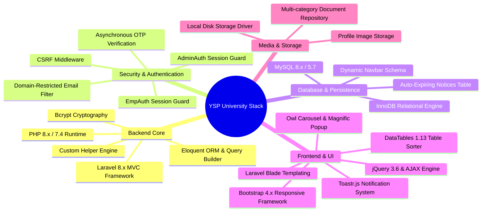

# ⚙️ Dr. YSP University — Technology Stack & Engineering Rationale

This document details the engineering choices behind the Dr. YSP University web and academic ERP platform ([https://uhf.ac.in/](https://uhf.ac.in/)) and the technical rationale for each selection.

---

## 1. Technology Matrix

---

## 2. Backend Stack & Rationale

### Laravel 8.x MVC Framework
- **Choice:** Laravel 8.x PHP Framework.
- **Rationale:**
  - **Rapid Domain Modeling:** Out-of-the-box routing, middleware pipelines, session management, file uploads, and Blade templating enabled rapid delivery of a university-scale web portal and faculty ERP.
  - **Expressive Query Builder & Eloquent:** Fluent query chaining simplifies multi-condition operations such as date comparisons for tenders (`whereNull('last_date')->orWhere('last_date', '>', $yesterday)`).
  - **Modular Architecture:** Clean separation of concerns between public landing controllers (`HomeController`), administrative controllers (`AdminController`), table managers (`AdminTablesController`), and faculty controllers (`EmployeeController`).

### PHP 8.x / 7.4 Runtime
- **Choice:** PHP with native JSON, fileinfo, and mail extensions.
- **Rationale:**
  - High performance, low memory footprint, and broad compatibility across Linux/Apache hosting environments commonly utilized by educational institutions.

### Custom Global Helpers (`app/helpers.php`)
- **Choice:** Autoloaded helper functions in `composer.json`.
- **Rationale:**
  - Encapsulates cross-cutting domain queries (such as `getFaculty($page)`) directly into reusable view functions, drastically reducing code duplication across dozens of constituent college views.

---

## 3. Frontend & UI Architecture

### Laravel Blade Templating Engine
- **Choice:** Server-rendered Blade views with master template inheritance (`@extends('layout')`, `@section('container')`, `@include('navbar')`).
- **Rationale:**
  - **Zero Client Hydration Overhead:** Critical for rural research stations and high-altitude KVK centers with low-bandwidth internet connectivity.
  - **Dynamic View Resolvers:** Handles hierarchical college paths (`/user/{type}/{page}`) dynamically, mapping requests into corresponding Blade templates.

### Bootstrap 4.x & CoolAdmin Dashboard
- **Choice:** Bootstrap 4 grid system and CoolAdmin administrative template.
- **Rationale:**
  - Mobile-responsive navigation bars, standardized form controls for faculty registration, and responsive data tables across mobile and desktop devices.

### jQuery 3.6, DataTables 1.13 & Toastr.js
- **Choice:** jQuery with DataTables and Toastr notification libraries.
- **Rationale:**
  - **Sub-100ms Status Toggling:** Super-admins toggle faculty activation status asynchronously with immediate Toastr visual feedback.
  - **Tabular Data Filtering:** DataTables delivers instant search, sorting, and pagination across extensive faculty rosters and academic course matrices.
  - **Asynchronous OTP Verification:** Handles email OTP challenge and verification in the background without refreshing the registration page.

---

## 4. Persistence & Storage Architecture

| Layer | Component | Purpose |
|---|---|---|
| **Relational Database** | MySQL (InnoDB Engine) | ACID-compliant storage for faculty profiles, circulars, tenders, dynamic menus, admins, and contacts. |
| **Media & Document Storage** | Local Filesystem (`storage/app/public/uploads`) | Partitioned storage for faculty profile pictures (`profile_images`), curriculum vitae (`emp_doc`), and circular PDFs (`docs`). |
| **Session Store** | File / Database Session Driver | Stores active administrative (`ADMIN_LOGIN`) and faculty (`EMP_LOGIN`) sessions, as well as transient verification OTPs (`emp_otp`). |

---

## 5. Engineering Standards & Quality Invariants

1. **Domain Email Verification Invariant:** Faculty registration is restricted to institutional / professional email domains (`tingebharat.com` / university pattern), preventing unauthorized registrations.
2. **Session-Bound OTP Validation:** An OTP is validated against the server session state before the user account is created in the database.
3. **Fail-Closed Session Security:** Administrative and faculty routes enforce strict middleware guards that reject unauthenticated access attempts and redirect immediately.
4. **Automated Expiry Rule:** Public circulars and tender listings must filter by `last_date` to prevent expired deadlines from displaying on public pages.
5. **Dynamic Page Assignment:** Faculty profile rendering in college views must decouple the physical view from the database record using the `page` slug attribute and `getFaculty()` helper.
