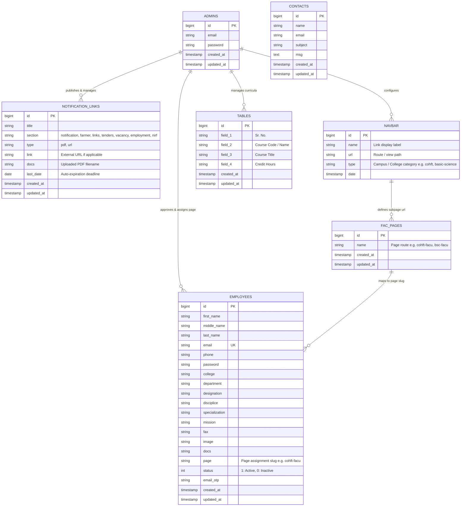

# 🗄️ Dr. YSP University — Database Entity-Relationship Diagram (ERD)

```mermaid
erDiagram
    ADMINS ||--o{ NOTIFICATION_LINKS : "publishes & manages"
    ADMINS ||--o{ NAVBAR : "configures"
    ADMINS ||--o{ TABLES : "manages curricula"
    ADMINS ||--o{ EMPLOYEES : "approves & assigns page"
    
    FAC_PAGES ||--o{ EMPLOYEES : "maps to page slug"
    NAVBAR ||--o{ FAC_PAGES : "defines subpage url"

    ADMINS {
        bigint id PK
        string email
        string password
        timestamp created_at
        timestamp updated_at
    }

    EMPLOYEES {
        bigint id PK
        string first_name
        string middle_name
        string last_name
        string email UK
        string phone
        string password
        string college
        string department
        string designation
        string disciplice
        string specialization
        string mission
        string fax
        string image
        string docs
        string page "Page assignment slug e.g. cohft-facu"
        int status "1: Active, 0: Inactive"
        string email_otp
        timestamp created_at
        timestamp updated_at
    }

    NOTIFICATION_LINKS {
        bigint id PK
        string title
        string section "notification, farmer, links, tenders, vacancy, employment, nirf"
        string type "pdf, url"
        string link "External URL if applicable"
        string docs "Uploaded PDF filename"
        date last_date "Auto-expiration deadline"
        timestamp created_at
        timestamp updated_at
    }

    NAVBAR {
        bigint id PK
        string name "Link display label"
        string url "Route / view path"
        string type "Campus / College category e.g. cohft, basic-science"
        timestamp date
    }

    FAC_PAGES {
        bigint id PK
        string name "Page route e.g. cohft-facu, bsc-facu"
        timestamp created_at
        timestamp updated_at
    }

    TABLES {
        bigint id PK
        string field_1 "Sr. No."
        string field_2 "Course Code / Name"
        string field_3 "Course Title"
        string field_4 "Credit Hours"
        timestamp created_at
        timestamp updated_at
    }

    CONTACTS {
        bigint id PK
        string name
        string email
        string subject
        text msg
        timestamp created_at
        timestamp updated_at
    }
```
