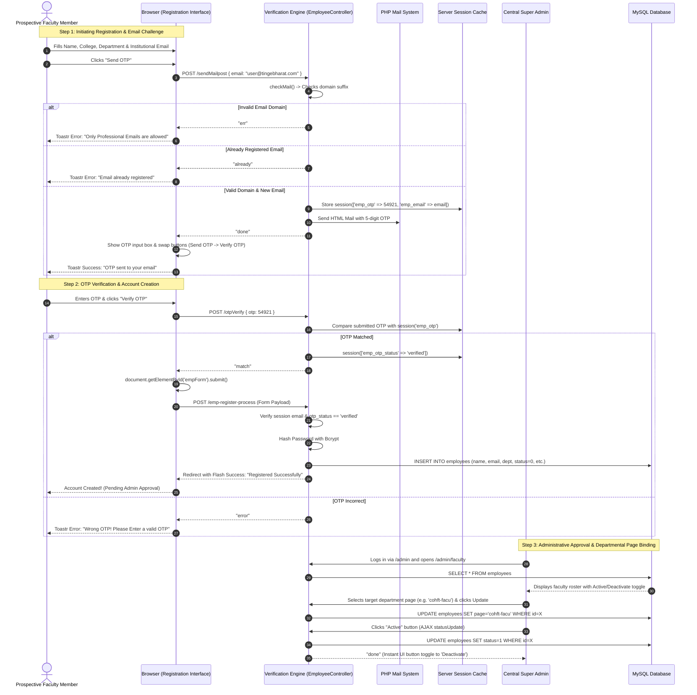

# 🔐 Dr. YSP University — Faculty Onboarding & Verification Flow

```mermaid
sequenceDiagram
    autonumber
    actor Faculty as Prospective Faculty Member
    participant UI as Browser (Registration Interface)
    participant Auth as Verification Engine (EmployeeController)
    participant Mail as PHP Mail System
    participant Session as Server Session Cache
    participant Admin as Central Super Admin
    participant DB as MySQL Database

    Note over Faculty, UI: Step 1: Initiating Registration & Email Challenge
    Faculty->>UI: Fills Name, College, Department & Institutional Email
    Faculty->>UI: Clicks "Send OTP"
    UI->>Auth: POST /sendMailpost { email: "user@tingebharat.com" }
    
    Auth->>Auth: checkMail() -> Checks domain suffix
    alt Invalid Email Domain
        Auth-->>UI: "err"
        UI-->>Faculty: Toastr Error: "Only Professional Emails are allowed"
    else Already Registered Email
        Auth-->>UI: "already"
        UI-->>Faculty: Toastr Error: "Email already registered"
    else Valid Domain & New Email
        Auth->>Session: Store session(['emp_otp' => 54921, 'emp_email' => email])
        Auth->>Mail: Send HTML Mail with 5-digit OTP
        Auth-->>UI: "done"
        UI->>UI: Show OTP input box & swap buttons (Send OTP -> Verify OTP)
        UI-->>Faculty: Toastr Success: "OTP sent to your email"
    end

    Note over Faculty, UI: Step 2: OTP Verification & Account Creation
    Faculty->>UI: Enters OTP & clicks "Verify OTP"
    UI->>Auth: POST /otpVerify { otp: 54921 }
    Auth->>Session: Compare submitted OTP with session('emp_otp')
    alt OTP Matched
        Auth->>Session: session(['emp_otp_status' => 'verified'])
        Auth-->>UI: "match"
        UI->>UI: document.getElementById('empForm').submit()
        UI->>Auth: POST /emp-register-process (Form Payload)
        Auth->>Auth: Verify session email & otp_status == 'verified'
        Auth->>Auth: Hash Password with Bcrypt
        Auth->>DB: INSERT INTO employees (name, email, dept, status=0, etc.)
        Auth-->>UI: Redirect with Flash Success: "Registered Successfully"
        UI-->>Faculty: Account Created! (Pending Admin Approval)
    else OTP Incorrect
        Auth-->>UI: "error"
        UI-->>Faculty: Toastr Error: "Wrong OTP! Please Enter a valid OTP"
    end

    Note over Admin, DB: Step 3: Administrative Approval & Departmental Page Binding
    Admin->>Auth: Logs in via /admin and opens /admin/faculty
    Auth->>DB: SELECT * FROM employees
    DB-->>Admin: Displays faculty roster with Active/Deactivate toggle
    Admin->>Auth: Selects target department page (e.g. 'cohft-facu') & clicks Update
    Auth->>DB: UPDATE employees SET page='cohft-facu' WHERE id=X
    Admin->>Auth: Clicks "Active" button (AJAX statusUpdate)
    Auth->>DB: UPDATE employees SET status=1 WHERE id=X
    Auth-->>Admin: "done" (Instant UI button toggle to 'Deactivate')
```
