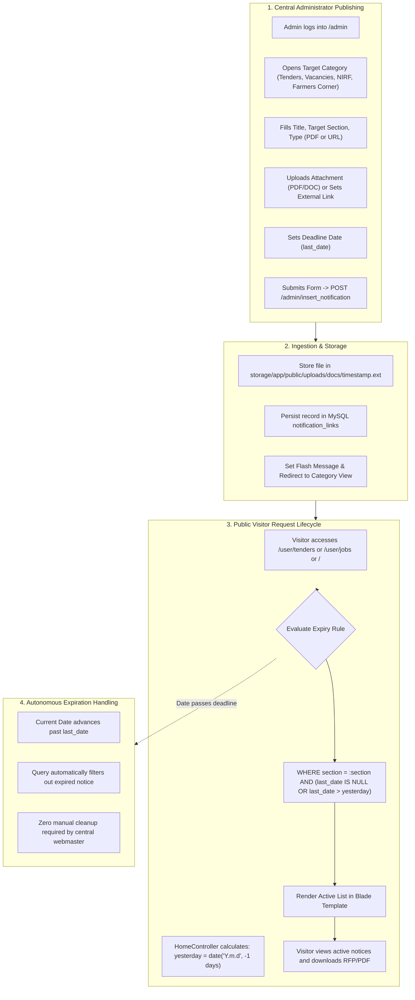

# 📢 Dr. YSP University — Circular, Tender & Notice Lifecycle Flow

```mermaid
flowchart TD
    subgraph AdminAction["1. Central Administrator Publishing"]
        A1["Admin logs into /admin"]
        A2["Opens Target Category (Tenders, Vacancies, NIRF, Farmers Corner)"]
        A3["Fills Title, Target Section, Type (PDF or URL)"]
        A4["Uploads Attachment (PDF/DOC) or Sets External Link"]
        A5["Sets Deadline Date (last_date)"]
        A6["Submits Form -> POST /admin/insert_notification"]
    end

    subgraph ServerProcessing["2. Ingestion & Storage"]
        B1["Store file in storage/app/public/uploads/docs/timestamp.ext"]
        B2["Persist record in MySQL notification_links"]
        B3["Set Flash Message & Redirect to Category View"]
    end

    subgraph ConsumerQuery["3. Public Visitor Request Lifecycle"]
        C1["Visitor accesses /user/tenders or /user/jobs or /"]
        C2["HomeController calculates: yesterday = date('Y.m.d', -1 days)"]
        C3{"Evaluate Expiry Rule"}
        C4["WHERE section = :section AND (last_date IS NULL OR last_date > yesterday)"]
        C5["Render Active List in Blade Template"]
        C6["Visitor views active notices and downloads RFP/PDF"]
    end

    subgraph AutoExpiry["4. Autonomous Expiration Handling"]
        D1["Current Date advances past last_date"]
        D2["Query automatically filters out expired notice"]
        D3["Zero manual cleanup required by central webmaster"]
    end

    AdminAction --> ServerProcessing
    ServerProcessing --> ConsumerQuery
    ConsumerQuery --> C3
    C3 --> C4 --> C5 --> C6
    C3 -.->|Date passes deadline| AutoExpiry
```
