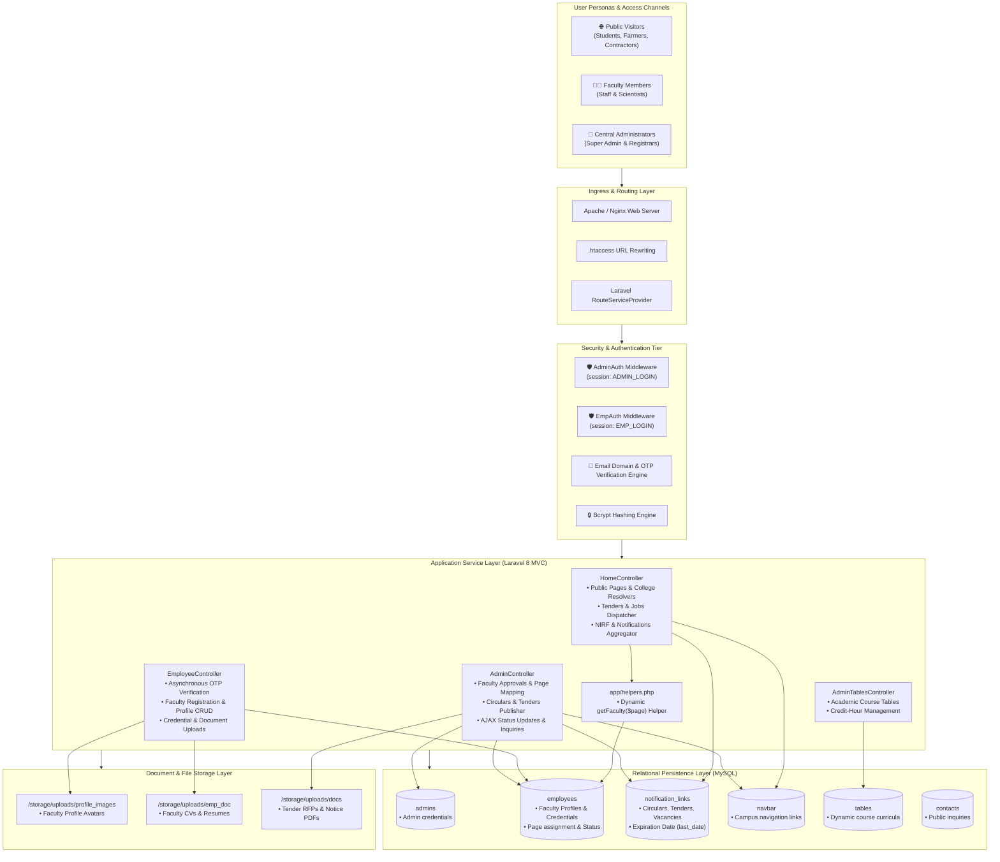

# 📊 Dr. YSP University — System Architecture Diagram

```mermaid
flowchart TD
    subgraph Users["User Personas & Access Channels"]
        U1["🌐 Public Visitors<br>(Students, Farmers, Contractors)"]
        U2["👨‍🏫 Faculty Members<br>(Staff & Scientists)"]
        U3["🏢 Central Administrators<br>(Super Admin & Registrars)"]
    end

    subgraph Ingress["Ingress & Routing Layer"]
        HTTP["Apache / Nginx Web Server"]
        HTACCESS[".htaccess URL Rewriting"]
        ROUTER["Laravel RouteServiceProvider"]
    end

    subgraph SecurityTier["Security & Authentication Tier"]
        ADMIN_AUTH["🛡️ AdminAuth Middleware<br>(session: ADMIN_LOGIN)"]
        EMP_AUTH["🛡️ EmpAuth Middleware<br>(session: EMP_LOGIN)"]
        OTP_FLOW["🔑 Email Domain & OTP Verification Engine"]
        BCRYPT["🔒 Bcrypt Hashing Engine"]
    end

    subgraph AppControllers["Application Service Layer (Laravel 8 MVC)"]
        HOME_CTRL["HomeController<br>• Public Pages & College Resolvers<br>• Tenders & Jobs Dispatcher<br>• NIRF & Notifications Aggregator"]
        EMP_CTRL["EmployeeController<br>• Asynchronous OTP Verification<br>• Faculty Registration & Profile CRUD<br>• Credential & Document Uploads"]
        ADMIN_CTRL["AdminController<br>• Faculty Approvals & Page Mapping<br>• Circulars & Tenders Publisher<br>• AJAX Status Updates & Inquiries"]
        TABLE_CTRL["AdminTablesController<br>• Academic Course Tables<br>• Credit-Hour Management"]
        HELPER["app/helpers.php<br>• Dynamic getFaculty($page) Helper"]
    end

    subgraph DatabaseLayer["Relational Persistence Layer (MySQL)"]
        TBL_ADMINS[("admins<br>• Admin credentials")]
        TBL_EMP[("employees<br>• Faculty Profiles & Credentials<br>• Page assignment & Status")]
        TBL_NOTIF[("notification_links<br>• Circulars, Tenders, Vacancies<br>• Expiration Date (last_date)")]
        TBL_NAV[("navbar<br>• Campus navigation links")]
        TBL_TABLES[("tables<br>• Dynamic course curricula")]
        TBL_CONTACTS[("contacts<br>• Public inquiries")]
    end

    subgraph StorageLayer["Document & File Storage Layer"]
        DIR_PROFILE["/storage/uploads/profile_images<br>• Faculty Profile Avatars"]
        DIR_DOCS["/storage/uploads/emp_doc<br>• Faculty CVs & Resumes"]
        DIR_NOTIF_DOCS["/storage/uploads/docs<br>• Tender RFPs & Notice PDFs"]
    end

    Users --> Ingress
    Ingress --> SecurityTier
    SecurityTier --> AppControllers
    
    AppControllers --> DatabaseLayer
    AppControllers --> StorageLayer
    
    ADMIN_CTRL --> TBL_ADMINS
    ADMIN_CTRL --> TBL_EMP
    ADMIN_CTRL --> TBL_NOTIF
    ADMIN_CTRL --> TBL_NAV
    ADMIN_CTRL --> DIR_NOTIF_DOCS

    EMP_CTRL --> TBL_EMP
    EMP_CTRL --> DIR_PROFILE
    EMP_CTRL --> DIR_DOCS

    HOME_CTRL --> TBL_NOTIF
    HOME_CTRL --> TBL_NAV
    HOME_CTRL --> HELPER
    HELPER --> TBL_EMP

    TABLE_CTRL --> TBL_TABLES
```
