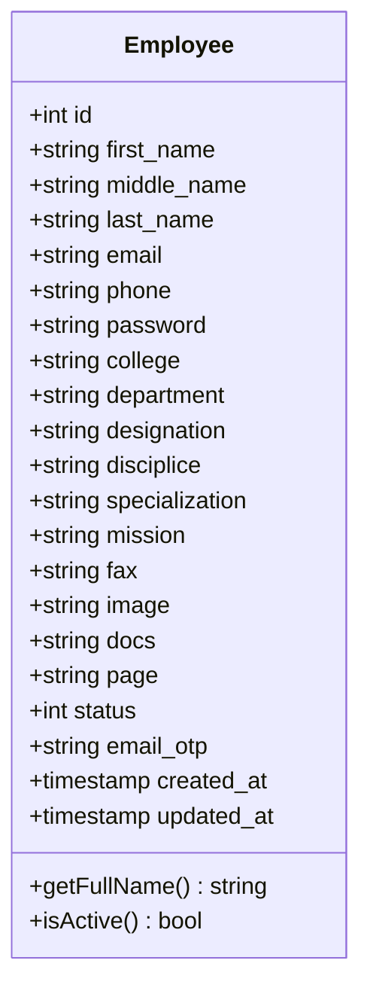

# 👨‍🏫 Domain: Faculty Management & Directory Engine

## 1. Domain Overview

In a multi-faculty institution such as Dr. YSP University of Horticulture & Forestry ([https://uhf.ac.in/](https://uhf.ac.in/)), maintaining verified, up-to-date faculty directories across numerous colleges, departments, and research centers is critical for academic accreditation (ICAR, UGC, NIRF), student advising, and research collaboration.

The Faculty Management module provides an integrated lifecycle:
1. **Self-Service Onboarding:** Verified university staff register their own profiles using institutional emails.
2. **Identity & Credential Registry:** Captures biographical data, academic designations, department affiliations, research missions, disciplines, profile avatars, and CV documents.
3. **Dynamic Page Association:** Administrative controllers map faculty accounts to dynamic departmental view slugs (`page` attribute), rendering them directly in respective departmental sections.
4. **Administrative Moderation:** Super-administrators maintain unilateral control over profile activation status (`status: 1` vs `0`).

---

## 2. Core Domain Data Model



---

## 3. Dynamic Helper Architecture (`getFaculty`)

To eliminate hardcoded HTML faculty lists across hundreds of departmental Blade views (such as `resources/views/pages/cohft-facu.blade.php`), the platform utilizes an autoloaded helper function:

```php
function getFaculty($page) {
    $users = DB::table('employees')
        ->where('page', $page)
        ->where('status', 1)
        ->get();
    return $users;
}
```

In any departmental Blade template, the faculty roster is rendered dynamically:

```blade
@foreach(getFaculty('cohft-facu') as $users)
    <div class="col-sm-12 head-block" style="background: url('/images/forest-bg.jpg');">
        <div class="col-md-2">
            image}}">
        </div>
        <div class="col-md-10">
            <h4>{{$users->first_name}} {{$users->middle_name}} {{$users->last_name}}</h4>
            <p><b>{{$users->designation}}</b></p>
            <p>{{$users->college}} - {{$users->department}}</p>
            <ul class="white">
                <li><span>Phone : </span> {{$users->phone}}</li>
                <li><span>Email : </span> {{$users->email}}</li>
            </ul>
        </div>
    </div>
@endforeach
```

---

## 4. Real-Time Status Moderation

Admins activate or suspend faculty accounts with one click via an asynchronous AJAX endpoint:
- **Route:** `POST /admin/statusUpdate`
- **Payload:** `{ id: 14, status: 1 }`
- **Response:** `"done"`
- **Client Handling:** JavaScript toggles button styling between red (Deactivate) and green (Activate) without triggering a browser refresh.
