# 🏫 Domain: Multi-Campus Academic & Research Hierarchy

## 1. Domain Overview

Dr. YSP University of Horticulture & Forestry ([https://uhf.ac.in/](https://uhf.ac.in/)) operates across an extensive geography in Himachal Pradesh. The web portal reflects this organizational hierarchy:

```mermaid
graph TD
    ROOT["Dr. YSP University of Horticulture & Forestry (Nauni, Solan)"]
    
    COLLEGES["Constituent Colleges"]
    RESEARCH["Regional Research Stations (RHR&TS)"]
    EXTENSION["Directorate of Extension & KVKs"]
    CENTRAL["Central Facilities & Administration"]
    
    ROOT --> COLLEGES
    ROOT --> RESEARCH
    ROOT --> EXTENSION
    ROOT --> CENTRAL
    
    COLLEGES --> C1["College of Horticulture (Nauni)"]
    COLLEGES --> C2["College of Forestry (Nauni)"]
    COLLEGES --> C3["College of Horticulture & Forestry (Neri, Hamirpur)"]
    COLLEGES --> C4["College of Horticulture & Forestry (Thunag, Mandi)"]
    
    RESEARCH --> R1["RHR&TS Mashobra (Apple & Temperate Fruits)"]
    RESEARCH --> R2["RHR&TS Jachh (Subtropical Fruits & Agroforestry)"]
    RESEARCH --> R3["RHR&TS Bajaura (Vegetables & Floriculture)"]
    RESEARCH --> R4["RHR&TS Sharbo (Cold Desert & High Altitude)"]
    RESEARCH --> R5["RHR&TS Dhaulakuan (Citrus & Watershed)"]
    
    EXTENSION --> K1["KVK Chamba"]
    EXTENSION --> K2["KVK Rohru"]
    EXTENSION --> K3["KVK Kinnaur"]
    EXTENSION --> K4["KVK Kandaghat"]
    EXTENSION --> K5["KVK Tabo (Lahaul & Spiti-II)"]
    
    CENTRAL --> ADM["VC Desk & Registrar"]
    CENTRAL --> LIB["Satyanand Stokes Library"]
    CENTRAL --> SWO["Students' Welfare Organisation"]
    CENTRAL --> CIC["Computer & Instrumentation Centre"]
```



---

## 2. Dynamic College Navigation Subsystem

The `navbar` database table provides category-scoped sub-navigation links for each college or department type:

```php
public function college_page($type, $page)
{
    $data['type'] = $type;
    $data['navLinks'] = DB::table('navbar')
        ->where('type', '=', $type)
        ->get();

    $exp = explode(".", $page);
    if (isset($exp[1]) && $exp[1] == 'html') {
        $page = $exp[0];
    }
    if ($page == 'coh-course') {
        $data['tables'] = Table::get();
    }

    return view("pages/$page", $data);
}
```

This routing architecture maps incoming campus routes (e.g. `/user/cohft/cohft-infr`) to their corresponding views while providing contextual sub-navigation menus without manual hardcoding.
