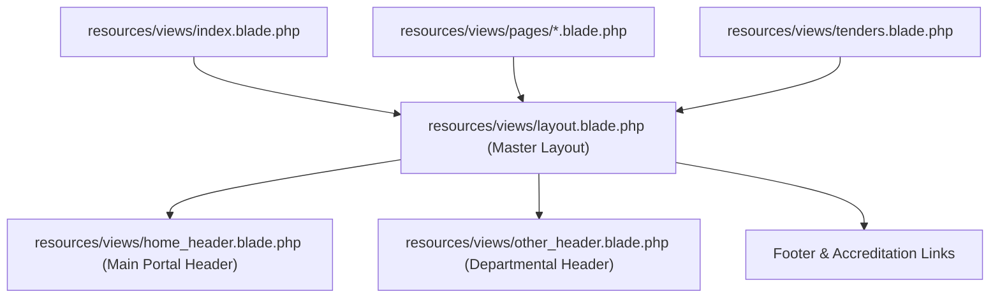

# 🎨 Engineering: Dynamic Routing & Blade Architecture

## 1. Overview

The YSP University platform serves hundreds of institutional, departmental, and research station subpages. Rather than generating rigid, duplicated route definitions, the routing architecture combines parameterized wildcard controllers with dynamic Blade view composition.

---

## 2. Dynamic Route Resolution Patterns

### 2.1 Dynamic Top-Level & College Resolvers
In `routes/web.php`:
```php
Route::get('{name}', [HomeController::class, 'front_pages']);
Route::get('user/{type}/{page}', [HomeController::class, 'college_page']);
```

In `HomeController.php`:
```php
public function front_pages($name)
{
    $data['header'] = "other_header";
    $exp = explode(".", $name);
    if (isset($exp[1]) && $exp[1] == 'html') {
        $name = $exp[0];
    }
    return view("pages/$name", $data);
}
```

This pattern safely handles both clean URLs (`/au-university`) and legacy `.html` redirects (`/au-university.html`), routing them into corresponding Blade view templates in `resources/views/pages/`.

---

## 3. Blade Layout Hierarchy & Modular Partials



### 3.1 Dynamic Header Injection
Controllers pass a `$data['header']` variable (`home_header` vs `other_header`), enabling context-specific headers, navigation bars, and breadcrumbs without layout fragmentation:

```blade
@if(isset($header))
    @include($header)
@else
    @include('home_header')
@endif
```

---

## 4. Administrative DataTables Integration

In administrative listing views (such as faculty registries and notification managers), DataTables 1.13 is initialized globally:

```javascript
$(document).ready(function () {
    $('#myTable').DataTable();
});
```

This delivers instant client-side column sorting, multi-keyword search, and pagination across tabular data sets.
