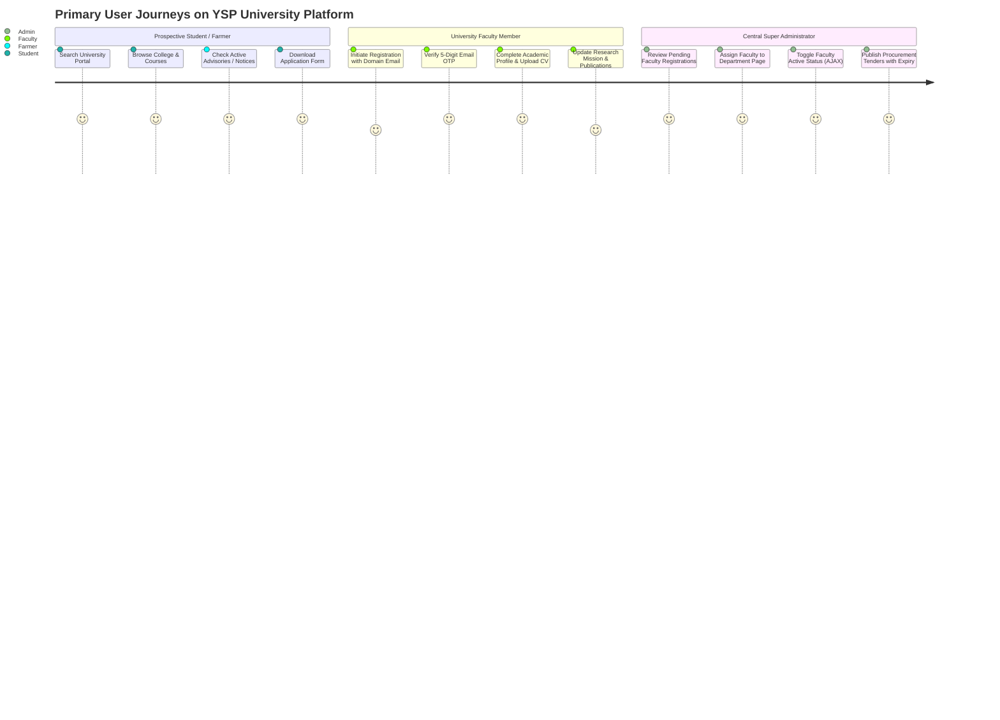

# 🌟 Product: Platform Overview & Institutional Scope

## 1. Product Vision

The Dr. YSP University Web Portal and Faculty ERP was created to serve as the unified digital backbone for Dr. Yashwant Singh Parmar University of Horticulture and Forestry (Nauni, Solan, Himachal Pradesh, India — [https://uhf.ac.in/](https://uhf.ac.in/)).

The platform bridges institutional governance, faculty research visibility, statutory public disclosures, student admissions, and farmer advisory outreach across Himachal Pradesh.

---

## 2. Target User Personas & Workflows

---

## 3. Core Functional Pillars

1. **Academic Governance & Faculty Verification:** Centralized management of faculty appointments, credentials, and page mappings.
2. **Statutory & Institutional Disclosures:** Real-time publishing and auto-expiration of tenders, job vacancies, NIRF rankings, and annual reports.
3. **Multi-College & Station Navigation:** Seamless browsing across constituent colleges at Nauni, Neri, and Thunag, as well as 5 Regional Research Stations and 5 KVK extension centers.
4. **Agro-Advisories & Farmer Outreach:** Dynamic circulars providing seasonal spray schedules and crop protection guidance to Himachal orchardists and farmers.
