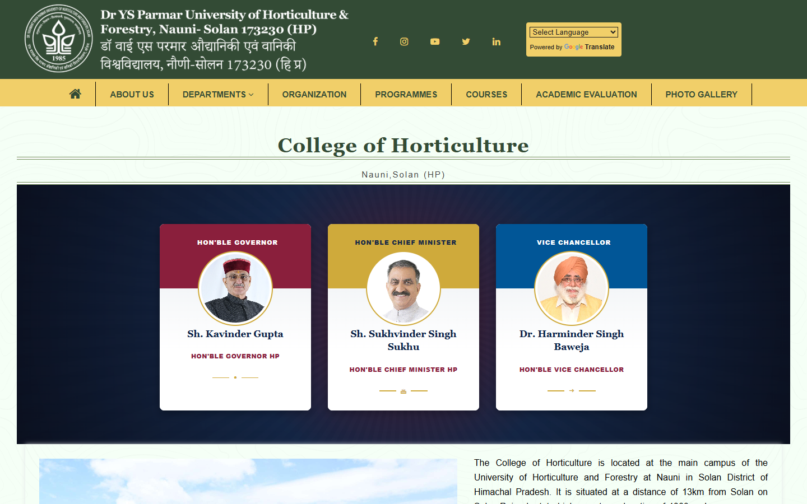
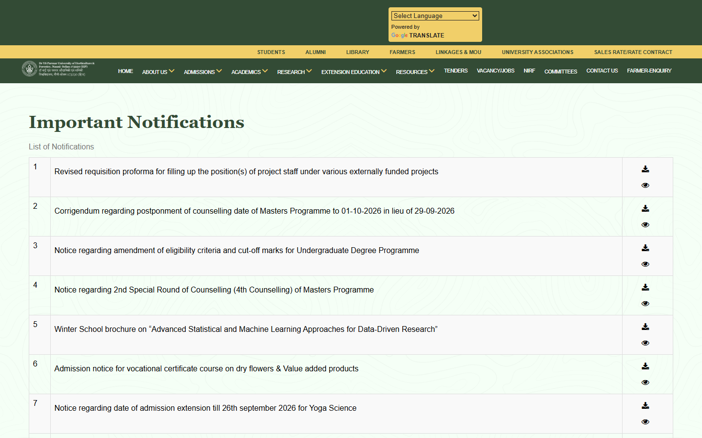
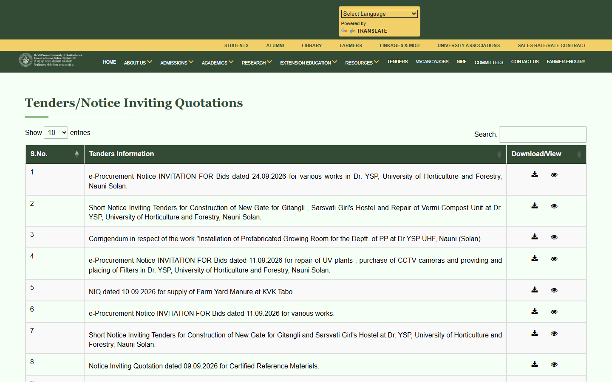
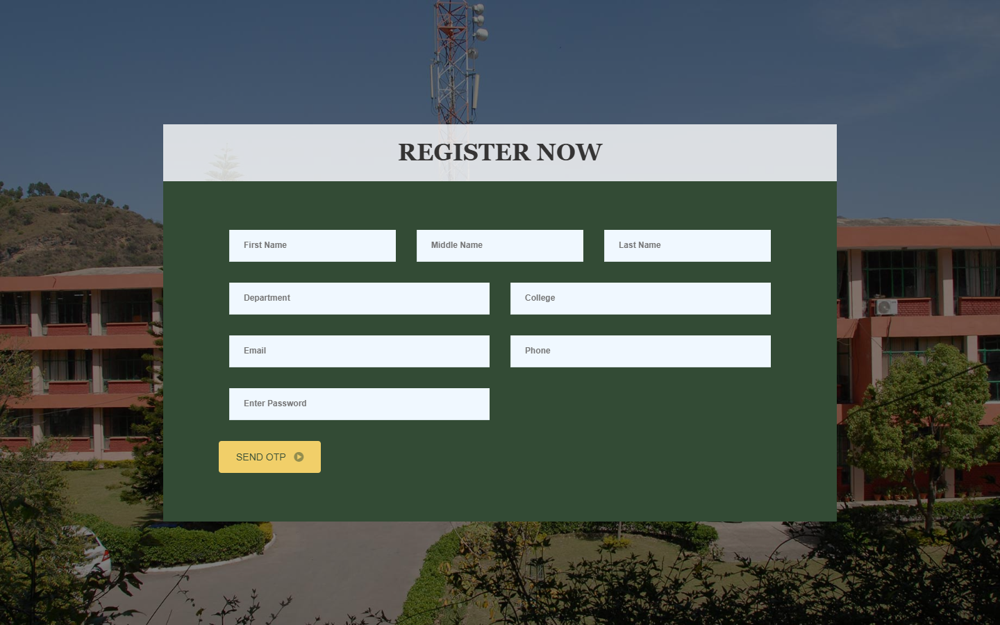

# 📸 Interface & Workflow Previews

This directory catalogs the visual layouts, design systems, and public interfaces of the Dr. YSP University Web Portal and Faculty ERP platform ([https://uhf.ac.in/](https://uhf.ac.in/)).

---

## 1. Public Institutional Web Portal

### 1.1 Institutional Landing Page & Hero (`/`)
*Modern responsive landing page featuring multi-campus navigation, quick access links for Students, Farmers, Library, dynamic notice tickers, and research showcases.*

  

---

### 1.2 Constituent College Portal & Department Hub (`/user/college-horticulture/...`)
*College of Horticulture (Nauni, Solan) campus portal with dynamic sub-navigation, departmental facilities, research divisions, and faculty rosters.*

  

---

### 1.3 Centralized University Circulars & Announcements (`/all-notification/notification`)
*Classified university notifications and administrative circulars with searchable records and downloadable official documents.*

  

---

### 1.4 Public Procurement Tenders & RFPs (`/user/tenders`)
*Centralized procurement tenders and bidding specifications with dynamic deadline-based auto-expiration filters and direct PDF downloads.*

  

---

## 2. Faculty Self-Service & Onboarding Portal

### 2.1 Asynchronous Domain Verification & Email OTP Registration (`/emp/register`)
*Secure self-onboarding portal enforcing institutional domain validation (`@tingebharat.com` / university pattern) with two-phase asynchronous email OTP verification.*

  

---

## 3. Administrative Governance Console (`/admin`)

### 3.1 Centralized Faculty Roster & Moderation (`/admin/faculty`)
- **Purpose:** Central operational registry displaying all registered faculty members, department associations, contact information, and moderation status.
- **Key Elements:**
  - DataTables 1.13 multi-column sorting and instant search.
  - Dropdown page selector to bind faculty records to dynamic college templates (`cohft-facu`, etc.).
  - Asynchronous AJAX status toggle buttons (`Active` / `Deactivate`) with live UI feedback.

### 3.2 Classified Circular & Tender Publisher (`/admin/notification/{url}`)
- **Purpose:** Segregated publishing console for Tenders, Vacancies, NIRF Reports, Farmer's Corner, and Academic Circulars.
- **Key Elements:**
  - Modal-based creation interface with document attachment upload (PDF/DOC) and external URL links.
  - Submission deadline date picker (`last_date`) driving the automated expiration engine.

### 3.3 Dynamic Course Matrix & Table Manager (`/admin/table/coh-course-table`)
- **Purpose:** Real-time curriculum and syllabus table editor.
- **Key Elements:**
  - Inline CRUD interface for course codes, course titles, and credit-hour breakdowns (`3(2+1)`).
