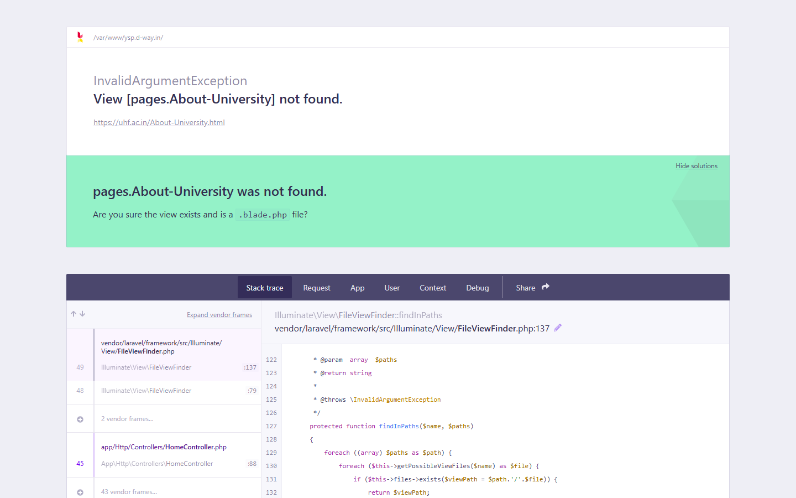
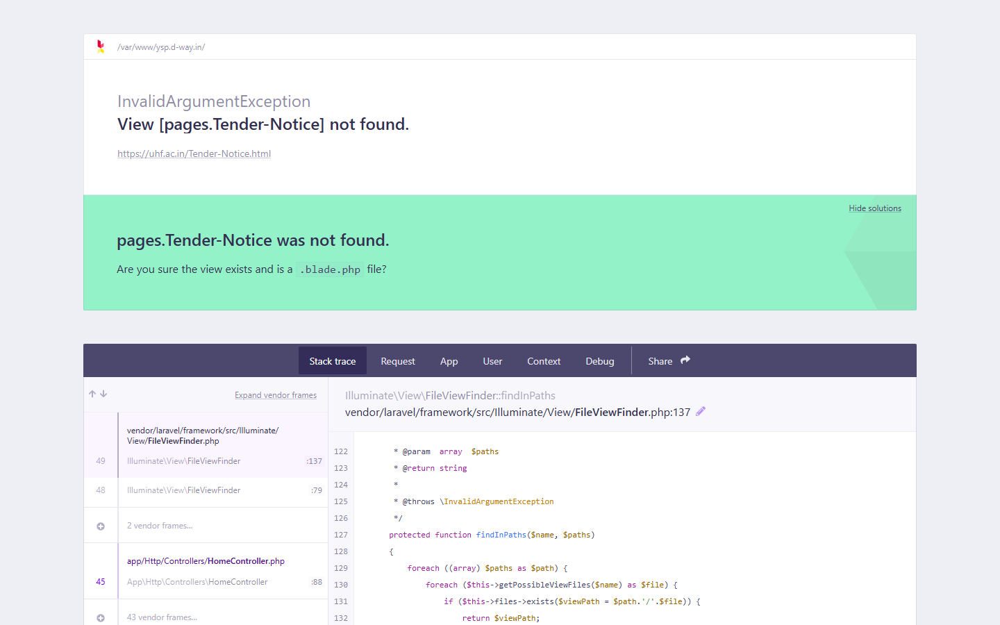

# 📸 Interface & Workflow Previews

This directory catalogs the visual layouts, design systems, and public interfaces of the Dr. YSP University Web Portal and Faculty ERP platform ([https://uhf.ac.in/](https://uhf.ac.in/)).

---

## 1. Public Institutional Web Portal

### 1.1 Institutional Landing Page & Hero (`/`)
*Modern responsive landing page featuring multi-campus navigation, quick access links for Students, Farmers, Library, dynamic notice tickers, and event showcases.*

  

---

### 1.2 About the University & Governance (`/About-University.html`)
*Institutional profile, Vice-Chancellor's Desk, research mandates, mission objectives, and campus location directories.*

  

---

### 1.3 Admissions & Academic Catalog (`/Admission-Notice.html`)
*Comprehensive admissions notices for Undergraduate (B.Sc. Hons), Postgraduate (M.Sc), MBA, Ph.D, and Diploma programs.*

  

---

### 1.4 Procurement Tenders & Statutory Notices (`/Tender-Notice.html`)
*Centralized procurement notices and bidding documents with automated deadline-based expiration filters and direct PDF downloads.*

  

---

## 2. Administrative Governance Console (`/admin`)

### 2.1 Centralized Faculty Roster & Moderation (`/admin/faculty`)
- **Purpose:** Central operational registry displaying all registered faculty members, department associations, contact information, and moderation status.
- **Key Elements:**
  - DataTables 1.13 multi-column sorting and instant search.
  - Dropdown page selector to bind faculty records to dynamic college templates (`cohft-facu`, etc.).
  - Asynchronous AJAX status toggle buttons (`Active` / `Deactivate`) with live UI feedback.

### 2.2 Classified Circular & Tender Publisher (`/admin/notification/{url}`)
- **Purpose:** Segregated publishing console for Tenders, Vacancies, NIRF Reports, Farmer's Corner, and Academic Circulars.
- **Key Elements:**
  - Modal-based creation interface with document attachment upload (PDF/DOC) and external URL links.
  - Submission deadline date picker (`last_date`) driving the automated expiration engine.

### 2.3 Dynamic Course Matrix & Table Manager (`/admin/table/coh-course-table`)
- **Purpose:** Real-time curriculum and syllabus table editor.
- **Key Elements:**
  - Inline CRUD interface for course codes, course titles, and credit-hour breakdowns (`3(2+1)`).

---

## 3. Faculty Self-Service Portal (`/employee`)

### 3.1 Domain-Restricted Email & OTP Verification (`/emp-register`)
- **Purpose:** Secure faculty self-onboarding interface.
- **Key Elements:**
  - Institutional domain validation (`@tingebharat.com` / university pattern).
  - Two-phase interactive OTP dispatch and verification without full-page reloads.

### 3.2 Faculty Profile Management (`/employee/profile`)
- **Purpose:** Academic profile and credential maintenance workspace.
- **Key Elements:**
  - Biographical data, academic discipline, research specialization, and mission statement forms.
  - Profile avatar and curriculum vitae (PDF) upload dropzones.
